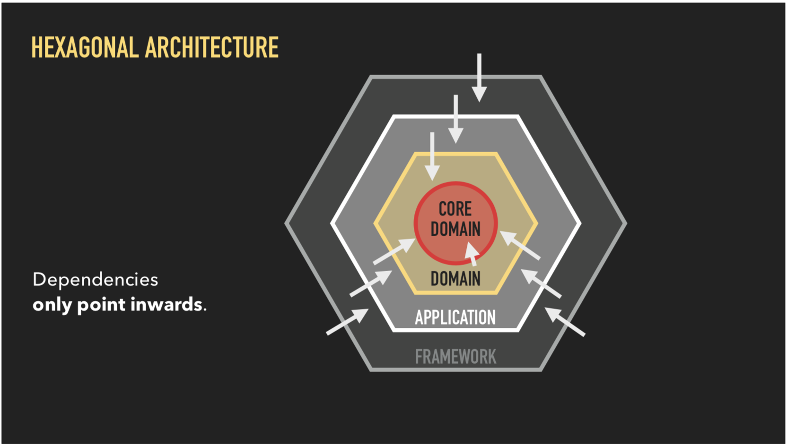

# Echo server (with debug abilities) in Go

It is very important to have a consistent structure that is simple, testable, and easy to understand. One of the most important principals of the design driven development approach is that the structure of the project should reflect how the software works.

Most popular code structuring approaches are:

- [Flat](https://sourcegraph.com/github.com/katzien/go-structure-examples@master/-/tree/flat)
- [Layered](https://sourcegraph.com/github.com/katzien/go-structure-examples@master/-/tree/layered)
- [Modular](https://sourcegraph.com/github.com/katzien/go-structure-examples@master/-/tree/modular)

There's a different approach that we can try - Grouping by context or also known as Domain Driven Development.

This leads to - Hexagonal Structure.

As an example, for a beer rewieving service, we could have these requirements

- Users should be able to add a beer.
- Users should be able to add a review for a beer.
- Users should be able to list all beers.
- Users should be able to list all reviews for a given beer.
- There should be an option to store data either in memory or in a JSON file.
- It should have the ability to add some sample data.

Hexagonal architecture helps achieve the goal of being able to easily change one part of the application without having to rewrite the entire thing. The key rule in the hex model is that dependencies are only allowed to point inwards.

The outer layer in the hex model can reach out to the domain as much as they like, but the domain cannot reference anything outside of it. This implies a heavy use of interfaces and Inversion of Control, and we define interfaces at every boundary to abstract away the details for each layer.

- Core domain will define the business logic in abstract term.
- Then the rest of the application which implements the core domain functionality will define their own storage functionality that they need from 3rd parties.
- The particular storage implementation will have to satisfy that interface.
- This means that as long as the interface required by the inner layer is satisfied, we can swap the outer layer implementations easily.

In the demo application we end up with the following architecture:

A huge benefit of this structure that becomes more visible in larger projects, is how it is very easy to extend it’s functionality without affecting multiple parts of the codebase. For example, you want to create an **RPC** version of the **API**. You would add it to the **`pkg`** directory and implement the interfaces.

---

> More detailed explanation here - <https://about.sourcegraph.com/blog/go/gophercon-2018-how-do-you-structure-your-go-apps>
